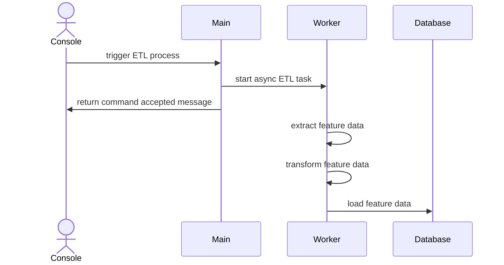
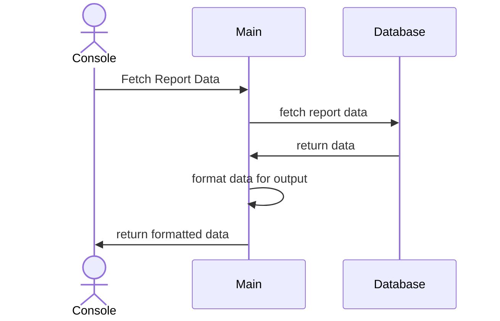

### Introduction
Analyze experiments performed and extract features from the data.

### Build and Run
#### Build
```text
docker compose build
```

#### Startup
```text
./up.sh
```

#### shutdown
```text
./down.sh
```

### Usage

#### Run ETL process
```text
curl localhost:9000/trigger_etl -X POST
```

##### ETL Process


#### Fecth Report Data
```text
curl localhost:9000/report
```

##### Report Data

